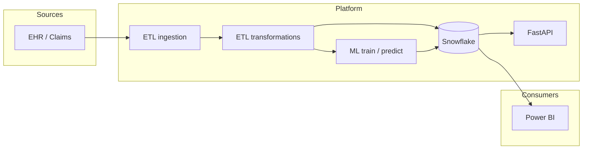

# Diagrams

Add **Mermaid** (`.mmd`) or exported **PNG/SVG** diagrams here.

## Example (high-level data flow)

Keep diagrams next to ADRs or architecture updates in `docs/architecture.md` for traceability.
